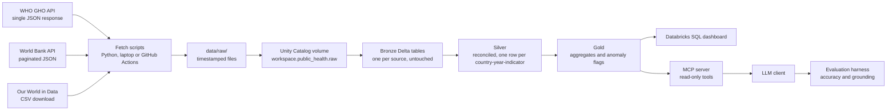
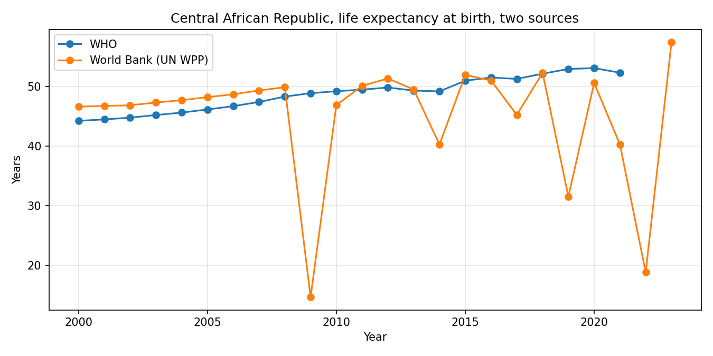

# Public health data lakehouse with an AI query layer

A medallion-architecture lakehouse on Databricks Free Edition that ingests three public health sources with different shapes, reconciles them, flags anomalies, and exposes the result to an LLM through an MCP server with an evaluation harness.

Built in public as a portfolio project. Every number in this README comes from a real run.

## Problem

Global health analysts pull the same indicators (life expectancy, under-5 mortality, measles vaccine coverage) from WHO, the World Bank and Our World in Data. The three sources disagree on country names and codes, on which years are covered, on units, and on how missing data is represented. Analysts reconcile this by hand in spreadsheets, and when a manager asks "which countries had a drop in measles coverage last year", the answer depends on which spreadsheet was open. This project builds the reconciled layer once and puts a natural-language interface on top that can be measured for accuracy rather than demoed.

## Who it is for

- A program analyst who needs one trustworthy number per country per year per indicator, with a record of where it came from.
- A program manager who wants to ask questions in plain English and know when the answer should be checked by a human.
- A hiring manager who wants to see that I can reason about ingestion, reconciliation, governance and LLM evaluation with working code.

## Architecture



Bronze is complete. Silver, gold, dashboard, MCP and evaluation are in progress.

## The three decisions that shaped the build so far

1. **Ingestion runs outside Databricks.** Free Edition restricts outbound internet from notebooks, so fetch scripts run on a laptop or in GitHub Actions and upload to a Unity Catalog volume. Databricks is the warehouse, not the scheduler. This also separates fetch from load, so each can be rerun alone.
2. **Bronze is a faithful copy.** Raw files are saved with a UTC timestamp before anything reads them, and bronze tables add only two columns: source file path and ingestion time. No renaming, no filtering, no type fixes. When silver logic is wrong, the fix is a rerun from bronze, not a re-download.
3. **One bronze table per OWID chart.** The three OWID CSVs have different value column names. Combining them would mean either a sparse table or a reshape, and reshaping is a transformation. Each chart gets its own table; silver does the reshaping.

The full log is in [docs/decisions.md](docs/decisions.md).

## What the sources actually look like

Observed in the bronze tables, not assumed:

| | WHO GHO | World Bank | Our World in Data |
|---|---|---|---|
| Access pattern | One JSON response per indicator | Paginated JSON, 1,000 rows per page, 18 pages for life expectancy | One CSV per chart |
| Country identity | ISO3 code only, no name | Name and ISO3 code, aggregates mixed in (for example AFE, "Africa Eastern and Southern") | Name and code, with OWID-specific codes for non-countries |
| Missing data | Row absent | Row present with null value (17,490 rows per indicator, 265 entities x 66 years, 10,001 non-null for measles) | Row absent (Afghanistan measles has 1980 then 1982) |
| Time coverage | Under-5 mortality from 1931, life expectancy 2000 to 2021, measles 2000 to 2025 | 1960 to 2025 for all three | Life expectancy from 1950 |
| Units | Under-5 mortality per 1,000 live births | Per 1,000 live births | Child mortality as a percentage |
| Breakdowns | Sex (female, male, both) on the same rows | None | None |

## Findings from bronze, before any cleaning

Comparing life expectancy for 2019 across the three sources for every country all three cover:

- The World Bank and OWID values are identical in every row, because both take the figure from UN World Population Prospects. There are two independent estimates here, not three.
- The largest disagreement between WHO and the UN-derived value is Central African Republic: 52.9 versus 31.5, a spread of 21.4 years. Nigeria is next at 10.1.

Looking at Central African Republic year by year:



| year | WHO | World Bank |
|---|---|---|
| 2018 | 52.1 | 52.3 |
| 2019 | 52.9 | 31.5 |
| 2020 | 53.1 | 50.6 |
| 2021 | 52.3 | 40.3 |
| 2022 | | 18.8 |
| 2023 | | 57.4 |

The WHO series moves by fractions of a year, which is how life expectancy behaves. The World Bank series swings by 20 to 40 years between adjacent years. A year-on-year change threshold would flag every one of those rows. This is the first anomaly the project found, and it was found by looking, before any detection code was written.

Query: `notebooks/02_source_comparison.ipynb`. Charts and what they mean: [docs/charts.md](docs/charts.md).

## Results so far

- 9 raw files, 3 per source, 76 MB on disk.
- 5 bronze Delta tables in `workspace.public_health`.
- `bronze_who`: 81,849 rows across three indicators (64,510 under-5 mortality, 12,936 life expectancy, 4,403 measles), written as one Parquet file of 2.9 MB from 56 MB of raw JSON.
- `bronze_worldbank`: 52,470 rows, 17,490 per indicator.
- `bronze_owid_*`: 21,565 rows (life expectancy), 17066 (child mortality), 9,048 (measles).

## How to run

Requires Python 3.11+, [uv](https://docs.astral.sh/uv/), and a Databricks Free Edition workspace with schema `workspace.public_health` and volume `raw` (see `notebooks/00_setup.ipynb`).

```bash
git clone https://github.com/akshitas-1/public-health-lakehouse.git
cd public-health-lakehouse
uv sync
cp .env.example .env   # then fill in DATABRICKS_HOST and DATABRICKS_TOKEN

uv run python ingest/fetch_who.py WHOSIS_000001
uv run python ingest/fetch_who.py MDG_0000000007
uv run python ingest/fetch_who.py WHS4_543
uv run python ingest/fetch_worldbank.py SP.DYN.LE00.IN
uv run python ingest/fetch_worldbank.py SH.DYN.MORT
uv run python ingest/fetch_worldbank.py SH.IMM.MEAS
uv run python ingest/fetch_owid.py life-expectancy
uv run python ingest/fetch_owid.py child-mortality
uv run python ingest/fetch_owid.py share-of-children-vaccinated-against-measles
uv run python ingest/upload_to_volume.py
```

Then run `notebooks/01_bronze.ipynb` in Databricks.

## What I would do next

Silver: a country dimension that maps all three sources' codes and names to ISO 3166, with aggregates in a separate table; one long fact table of country, year, indicator, value, source; a rule for which source wins when values disagree, recorded per row.

## Interview questions this project lets me answer

- How do you handle three sources that paginate, batch and download differently? (fetch scripts, one pattern each)
- Why keep raw data if you are going to transform it anyway? (bronze principle, rerun without re-download)
- How does a Delta table differ from a folder of Parquet files? (transaction log, `DESCRIBE HISTORY`, versioning)
- What is the difference between a missing row and a null row, and why does it matter? (World Bank vs WHO, anomaly detection later)
- Where should secrets live in a data pipeline? (`.env` locally, GitHub Actions secrets in CI, never in code)
- Why did one source's file come in ten times larger for the same indicator? (WHO under-5 mortality has more dimensions and a longer history)
- Are three sources three independent estimates? (World Bank and OWID both copy the UN for life expectancy; record upstream origin, not just the API)
