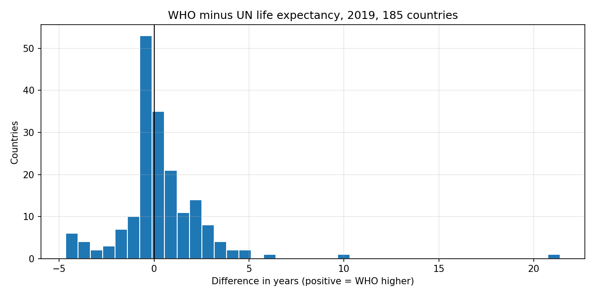
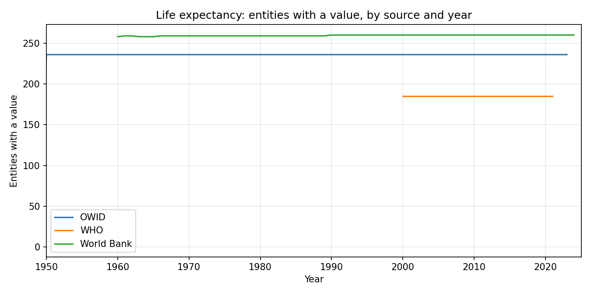

# Charts

Every chart is produced by `notebooks/03_charts.ipynb`, saved to the `outputs` volume in Databricks, and pulled into this folder by `ingest/download_outputs.py`. Rerun the notebook and the script to refresh them. All numbers below come from the runs that produced these images.

## 1. One country, two sources

**What it shows.** Life expectancy at birth for Central African Republic, 2000 to 2023, from WHO and from the World Bank (which takes its figure from UN World Population Prospects).

**What it means.** The WHO line moves by fractions of a year, which is how life expectancy behaves. The World Bank line drops to 40.3 in 2014, 31.5 in 2019, 18.8 in 2022, then jumps to 57.4 in 2023. No population lives like that. A rule as simple as "flag any year-on-year change over 3 years" would catch every one of those points. This is the first anomaly the project found, by looking, before any detection code was written, and it is why silver keeps a per-row record of which source each value came from rather than picking one source of truth up front.

## 2. How far apart the two estimates are, across the world

**What it shows.** For every country with a 2019 life expectancy value in both WHO and the World Bank (185 countries), the difference WHO minus World Bank. The vertical line is zero, perfect agreement.

**What it means.** 107 of 185 countries agree within one year and 139 within two. Only 5 are more than five years apart. The two independent estimates agree for most of the world and disagree badly for a handful, so the reconciliation rule cannot be a global "prefer source X". It has to be per row: when the two agree, either is fine; when they diverge past a threshold, the row is flagged and a human decides.

## 3. Who covers what, and when

**What it shows.** How many entities have a life expectancy value each year, by source. OWID starts in 1950, the World Bank in 1960, WHO in 2000.

**What it means.** Three sources, three definitions of "the world". In 2019: WHO 185 countries, OWID 236 entities, World Bank 260 entities including around 45 regional and income-group aggregates that bronze cannot yet tell apart from countries (the axis says "entities" for that reason). WHO's series stops at 2021 while the World Bank runs to 2024, so for 2022 onward there is only one estimate and no disagreement to detect. Silver's country dimension has to settle which 185 to 260 identities count as a country, and gold's anomaly flags have to know when a value had a second opinion and when it did not.
